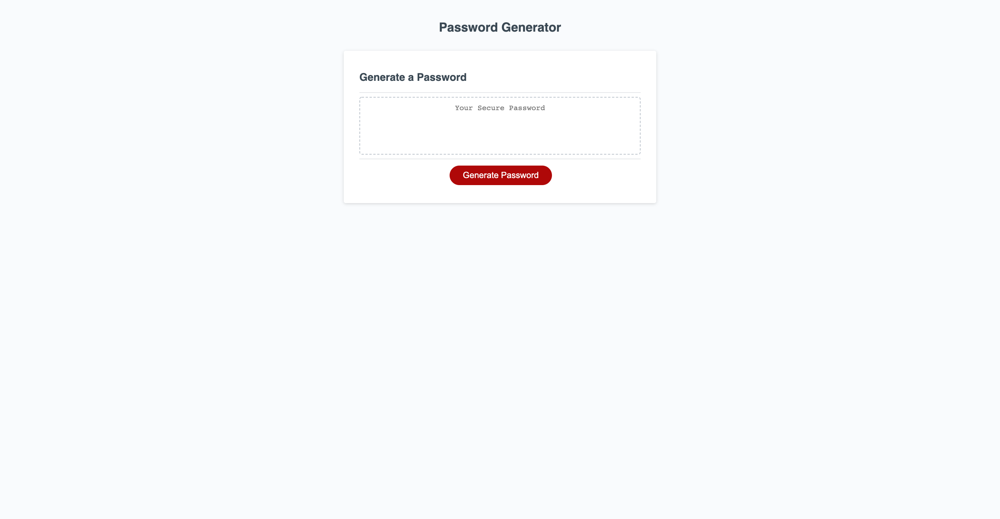

# password-generator
Password Generator UCF Bootcamp

## composed by
Stephanie Chaparro

## project location ##
[repo link](https://github.com/schaparro08/password-generator)
[live link](https://schaparro08.github.io/password-generator/)

## Description
The password generator uses conditional statements to create a randomized password that is composed of uppercase letters, lowercase letters, special characters, 
and numbers. These selections are then pushed into an array where they are randomized to create a password that is between 8 and 128 characters in length.

**contact information**
schaparro2021@gmail.com

Project example

